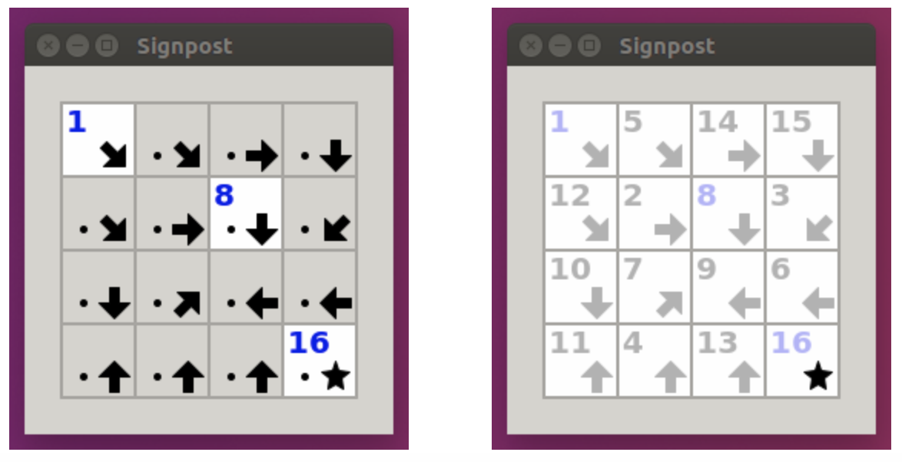

Signpost
=============
###### Data Structures (CS61B-Fa19) taught by Prof. Hilfinger at UC Berkeley 
### CS61B project 1

--------------------------

# Introduction
The puzzle game Signpost is one of Simon Tatham's collection of GUI games (available on a variety of operating-system configurations, including Ubuntu.) He attributes the puzzle to Angela and Otto Janko, who call it Pfeilpfad (arrow path). In this mini-project, you are given an incomplete Java program that creates these puzzles and allows its user to solve them, and you must supply the missing parts to complete the implementation.

The puzzle itself is quite simple. It is played on a W×H rectangular grid of square cells. All but one of the squares is annotated with an arrow pointing horizontally, vertically, or diagonally. The remaining square—the goal—is annotated with a star. Some squares contain distinct numbers between 1 and W⋅H. The first and last squares in sequence (those numbered 1 and W⋅H) are always numbered. The puzzle may be set to have free ends, in which case the first and last squares may appear anywhere on the board. By default, there are no free ends and the first and last squares are in the upper-left and lower-right corners, respectively. The idea is to connect the squares into a sequence from square 1 to W⋅H. Each square is connected to another that is in the direction of its arrow such that all the squares are connected. If a square initially has a number, it must be the number of that square in the sequence of connected squares.

The diagrams below show a sample puzzle on the left and its solution on the right. The bottom-left corner of the board has the coordinates (0,0), with the positive x-axis running horizontally to the right, and the positive y-axis running vertically upwards.

To connect two squares, press and hold on the first in sequence and drag to the second. To disconnect them, press and hold on the first, drag to a position off the grid, and release.
